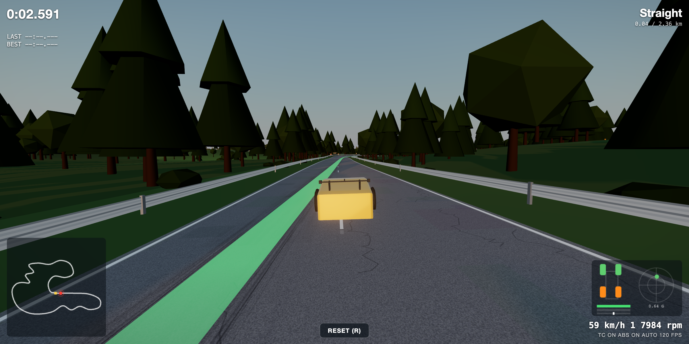

# Nordschleife Sim



A first-person driving simulator running on **real OpenStreetMap track geometry** —
Three.js rendering over a hand-written **240 Hz vehicle physics engine**. One
codebase, shipped to web and Android (Capacitor).

**▸ Play — [track.bwchoi.com](https://track.bwchoi.com)**  ·  [System Overview](https://track.bwchoi.com/data/game_logic.html)

## Features

- **Real tracks** — Nürburgring Nordschleife (20.7 km, OSM geometry + DEM elevation),
  Spa-Francorchamps, and a practice circuit.
- **Custom physics (240 Hz)** — raycast suspension, Pacejka combined-slip tires,
  clutch launch model, aerodynamics, per-surface and weather grip.
- **Weather & time** — noon, Eifel morning fog, sunset, night, rain (wet road +
  reduced grip), and night with street lighting.
- **Feel** — AudioWorklet waveguide engine sound, instrument cluster with shift
  lights, ghost laps, and a dynamic racing line.

## Run

```bash
npm install
npm run dev      # http://localhost:8741
npm run build    # → dist/
```

Android (Capacitor): `npm run build && npx cap sync android`, then Gradle `assembleDebug`.

## Controls

```
↑ / W  throttle      ↓ / S  brake (reverse at standstill)     ← → / A D  steer
Space  handbrake     M  auto / manual shift     C  camera      N  weather / time
L  racing line       G  ghost lap               R  reset to track     H  help
```

## Data & Credits

- **Track geometry** — © [OpenStreetMap](https://www.openstreetmap.org/copyright)
  contributors, **ODbL 1.0** (derived via the Overpass API).
- **Elevation** — [open-elevation.com](https://open-elevation.com/) (SRTM, public domain).
- **Engine sound** — ported from
  [engine-sound-generator](https://github.com/Antonio-R1/engine-sound-generator)
  © Antonio-R1 (MIT).
- **Fonts** — Google Fonts: Doto, Space Grotesk, Space Mono, Noto Sans KR (OFL / Apache 2.0).

## License

Code is **MIT** (see [LICENSE](LICENSE)). Bundled track data is **ODbL 1.0**
(derived from OpenStreetMap).

Fan project, non-commercial. Car and track names and other marks belong to their
respective owners and are used for identification only — not affiliated with or
endorsed by Hyundai, Porsche, Nürburgring GmbH, or any trademark holder.
